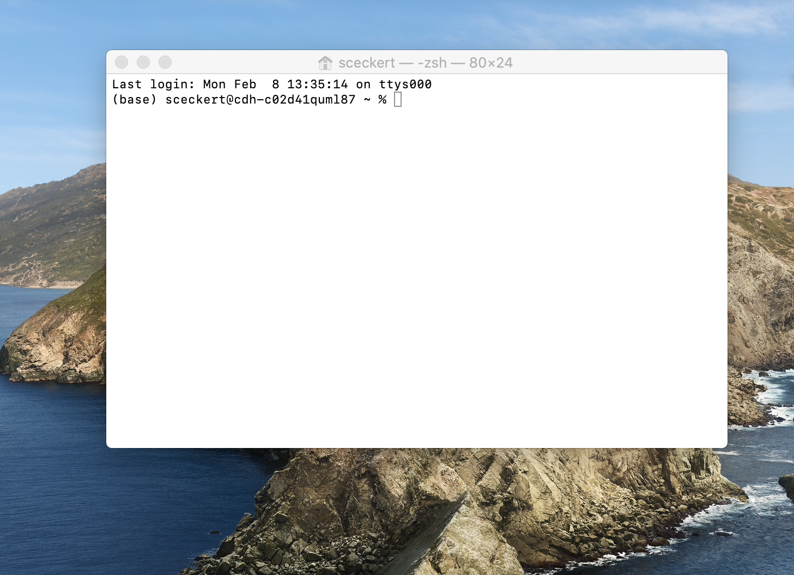
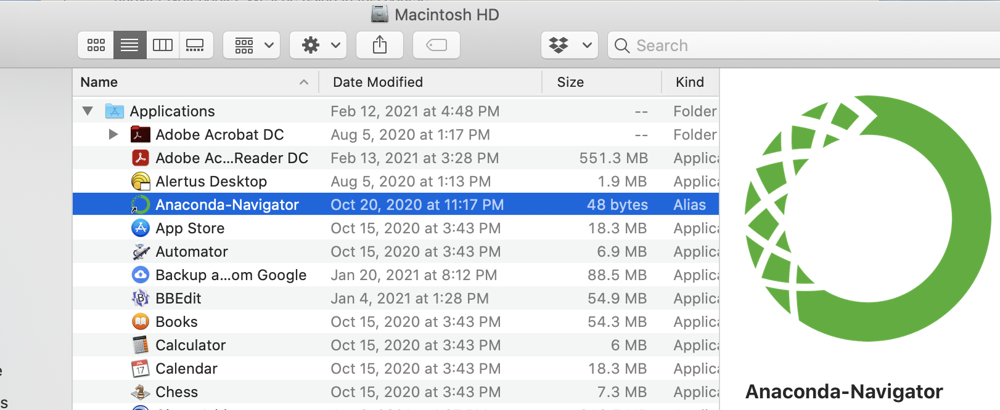
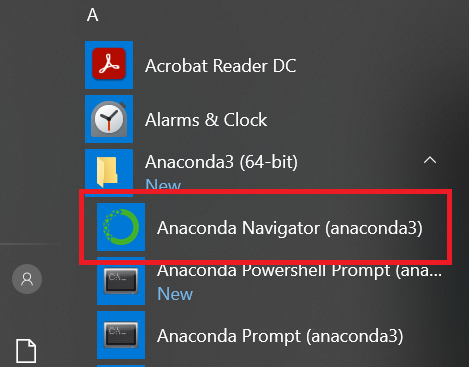
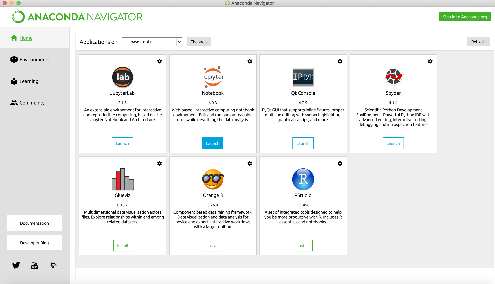

# Research Exercise 1: Introduction to programming

This week's homework has two main goals: 1) to introduce you to the command line––a way of interacting with your computer that allows us to create files, run scripts (like in Python), fetch items from a remote server,  and perform some basic forms of analysis on files and on collections of files––and 2) to get us all set up to start experimenting with Python –– a programming language that we'll be using to build on the skills for analyzing texts that we began to develop using the command line interface.  

What we're going to do:

- Set up the command line
- Read and complete a short tutorial on the basic commands associated with the command line
- Complete some command line warm-up exercises 
- Install Python (through Anaconda) and a text editor 

Don't be alarmed by the length of this homework––part 2 is simply a series of detailed instructions on how to install the correct distribution of Python, which will make it much easier for all of us to work in the same coding environment.  

The only written parts that I'll ask you to turn in are Part 1.c, and 1.d, but please make sure that you have Anaconda installed (and have completed the Programming Historian Tutorial

## PART 1: The Command Line

### What is the Command Line? 

The command line is a  way of interacting directly with your computer, using human-readable text. The command line is sometimes called ––sometimes called the *Terminal* , the *shell*, or *bash*, –For more on the differences between each of these terms, see the [DHRI's excellent glossary.](https://github.com/DHRI-Curriculum/glossary/blob/v2.0/terms/command-line.md)

What *is* a command line? Many parts of your computer are designed as a "graphical user interface" –– you can interact with files, applications by clicking, and manipulating visual icons (those little virtual folders, files, and app icons). A command line allows you to do the same, but instead of interacting with icons, we interact through a single interface by typing in text commands.

### 1.a Setting up the terminal

#### For Macs:

- On a Mac, the command line interface is called "the Terminal." 
- Navigate to "Applications" to a folder called "Utilities," then launch the Application called Terminal.  You should see the following:

The prompt displays the name of your machine, followed by a $ or %, depending on your set-up. This prompt is where you enter commands.

#### For Windows:

- Unlike MacOS, which is Unix based shell, Windows uses a non-Unix based shell. Recent editions of Windows do include an emulator, called **PowerShell**, which include many (though not all) of the same commands as MacOS's Terminal
- To access Powershell, search for it it in the windows search bar, and click on the icon to launch it

### 1.b Command line basics

Complete Ian Milligan and James Baker's[ "Introduction to the Bash Command Line" in *The Programming Historian*.](https://programminghistorian.org/en/lessons/intro-to-bash)

*Note*: Milligan and Baker's tutorial refers to **bash** language and something called the **bash shell**. (You can see the word "bash" at the top of their terminal screen) if you're running a Mac with a newer operating system, you might see something slightly different: "zsh". This means that you're running a z-shell, which is just an extension of bash. Rest assured, all of the commands written in this bash tutorial will still be able to run in ZSH.

### 1.c Exercises

Write down the commands you would input into the Terminal in order to do the following:

1. Move to a directory three levels up from your current directory...
2. ...then, tell me where I am
3. Move from your directory to a directory one level down called "sample-directory" ... (hint, you'll have to create that directory)
4. ...and then list the contents of that directory.
5. Display all of contents of [the Project Gutenberg Australia copy of Woolf's *A Room of One's Own*](https://gutenberg.net.au/ebooks02/0200791.txt) (You'll have to first download the plain text file using the instructions in the "Interacting with Files" part of Baker and Milligan's tutorial).
6. Display just the first 10 lines of that same file of Woolf's essay.
7. Copy the text file to a new directory called "Data-and-Literary-Study". 
8. Use the manual command to look up the commands "wc" and "grep"  
	- Note:  in Window Powershell, these commands are slightly different than in the terminal: they are "help,"  "gc" and "findstr"), respectively.
9. What sorts of things might the "wc" (or "gc" in Powershell) help you do? What sorts of things might the command "grep" allow you to do?
10. Take a sneak peak at Wednesday's introduction of the command line sections ["Working with text files" ](https://github.com/sceckert/Data-and-Literary-Study-Spring2022/blob/main/_week1/introduction-to-the-command-line.md#working-with-files-and-texts) and ["Analyzing text files"](https://github.com/sceckert/Data-and-Literary-Study-Spring2022/blob/main/_week1/introduction-to-the-command-line.md#analyzing-text-files) sections.  
	- What command would you write to find all appearances of the words  "woman" and "women" and the lines they appear on) in Woolf's essay?

### 1.d Reflection

Look back at what you've learned about the structure of the Unix shell and the few commands you learned. Write a few sentences reflecting on the following: How does Unix work? What was it like to interact with the computer through the command line? What do you notice about thew way that bash/zsh language is structured? What was it like to interact with Woolf's essay in this way? What kinds of research questions could you ask with the basic Unix commands you've learned? What kinds of questions would be challenging or difficult to pursue with these command line methods?

---

## PART 2: Installations  

#### Installing Anaconda + a text editor

In this course, we're going to be working primarily with Python.[1](#myfootnote1)
 While there are a number of ways to install Python, we're going to install the latest version of Python 3 using Anaconda. Anaconda is a Python distribution that comes with other really useful data science packages as well as the open-source web application, Jupyter Lab and Jupyter Notebooks (more on that in a bit). Not only does Anaconda have tools that help us to collect, analyze, and display data, it also has some neat functions––like an app that ability to write code and plain prose in the same document. 

#### 2.a Install Anaconda

1. Go to [the Anaconda website](https://www.anaconda.com/products/individual). Scroll down to the bottom of the page to find the downloader for your operating system. Find your operating system, and click on the link to download the installer. Unless you're already very comfortable using the command line, you should choose the "Graphical Installer" version, which will allow you to navigate Anaconda through an app-like interface called **Anaconda Navigator**.  

2. Once you click on the link, follow the instructions to open the installer, and follow the installer directions. 
	- For Mac OS: Select "Install for me only" when prompted to select a destination (If you get an error message, re-select "Install for me Only") 
	- For Windows: Select "Just Me," then select a destination folder to install Anaconda (this folder name should not contain any spaces) 
	- For Linux, you will not have the option to install the Graphical installer. Instead, follow the instructions for your Linux distribution here: [https://docs.anaconda.com/anaconda/install/linux/](https://docs.anaconda.com/anaconda/install/linux/)

3. Anaconda will ask whether you want to add Anaconda to your PATH environmental variable. You don't have to do this, since you will be able to launch Anaconda through a graphical interface (like you would any other application). By adding Anaconda to your PATH, you will be able to launch Jupyter notebooks from the command line as well as from the Anaconda Navigator interface.

3. Once you have downloaded Anaconda, verify your installation: [https://docs.anaconda.com/anaconda/install/verify-install/](https://docs.anaconda.com/anaconda/install/verify-install/)

#### 2.b Launch Anaconda ####

Launch Anaconda Navigator as you would any app.

- For Mac OS, navigate to your "Applications" folder, then click on the Anaconda Navigator icon (or search "Anaconda Navigator" in Finder)

- For Windows: Navigate to the Windows start menu. "Start" > "Anaconda4 (64-bit)"  >  "Anaconda Navigator" 

You should see the following Anaconda Navigator menu:

You did it! We'll go over using Anaconda as a Python environment in the next few sessions.

#### 2.c Installing a Text Editor 

We are going to be working with plain text files. While you can certainly use default text applications on your machines, such as Notepad (Windows) or TextEditor (Windows), it helps to have an editor better suited to handling text files that include some code. BBEDit and Atom are both good open-source text editors. Choose one to install: 

- To download BBEDit, go to [the download page](https://www.barebones.com/products/bbedit/index.html) and select the free version
- To download Attom, visit the download page, and then follow [the download instructions](https://flight-manual.atom.io/getting-started/sections/installing-atom/) for your operating system.

<a name="myfootnote1">1</a>:  Why Python? One reason is that it's flexible and popular within digital humanities research. It popularity means that you're likely to find collaborators familiar with the tool, and, unlike some other slightly more boutique tools or programming language, Python has a dedicated community of users and developers, which helps to ensure that Python will be around in a few years. No tool or programming language or platform is perfect––this will be a running question we'll exploring in this course-– but it does help to pick a tool or a method to learn that will be around for the loner term and that will grow with you. Take a look at ["Which DH Tools Are Actually Used in Research?"](https://weltliteratur.net/dh-tools-used-in-research/) (Dec. 6, 2019), a study by Laure Barbot, Frank Fischer, Yoann Moranville and Ivan Pozdniakov, which looks at tools mentioned in the DH conferences, ADHO between 2015-2019
