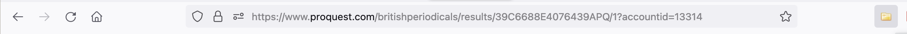

# Research Exercise #3: nineteenth-century reviews as data
Adapted from an exercise by Rachel Buurma

What did early 19th-century readers think of *Northanger Abbey* ? And how would we go about finding the answer to this question? One place to start would be with written records of their responses. There are two main kinds of response we could think about– the published reviews of professional readers ("reviewers" or "critics") and the more casual mentions in memoirs, letters, and other manuscript documents of lay or everyday readers, but this exercise will focus on the first type of evidence: professional reviews.

For **part one,**  please **locate** and **read 3 reviews of *Northanger Abbey* (1818) in their original 19th-century format**. You can use electronic facsimiles or you can locate the reviews in the physical copies housed in Firestone Library. Try to choose a mix of newspaper and magazine reviews found using a variety of different search methods. Since none of the following methods is comprehensive, make sure **at least two different methods** to locate your reviews.

For **part two**, you're going to practice creating a small bibliographic dataset of your reviews. 

For **part three**, please see the instructions below on how to write up a short reflection on you reviews.


## PART 1. Finding Reviews 

### 1.a Finding citations of reviews
1. Often, we'll have to find a citation and then use the citation to locate an actual copy of the review. Here are some places you can start looking:
	-  **Online proprietary (paid-for) periodicals indexes:** (note that many of these are *not* the articles themselves, just indexes to the articles) 
		-  Within one of the resources,  search **"northanger abbey"** (make sure to include the quotation marks). Try to use the date range or other facets on the left-hand side to narrow down your search. Remember, the novel was originally published in 1818, though starting in 1833, it was also republished in various cheap editions throughout the 19th-century, as [Janine Barchas has noted](https://lithub.com/the-obscure-editions-of-jane-austen-novels-that-made-her-internationally-known/), and in new editions in the early 20th century, as Deidre Lynch. For consistency's sake, try and pick ONE edition ––be it the first edition in 1818, the early Victorian reprint in 1833––an
		- Periodicals (published weekly, monthly, quarterly)
			-  [Periodicals Index Online (ProQuest)](https://library.princeton.edu/resource/19021) this resource will also allow you to search for the citation and the full-text simultaneously
			-  [19th Century Masterfile](https://library.princeton.edu/resource/3552) (some of which also give you access to the full text of periodicals)
			-  [C19: The Nineteenth-Century Index](https://library.princeton.edu/resource/4896)
			-  [Historical Newspapers Online](https://library.princeton.edu/resource/3836) this resource includes an index to the *Times of London* and *The New York Times*
	- **Scholarly books and articles**  
		- Consult the bibliography of a scholarly or critical edition of a novel. 
			- Ex: In the 2002 Broadview 2nd edition, edited by Claire Grogran, "Appendix E" includes a "Reviews of *Northanger Abbey*)
				- Select 1-2 of these citations to track down (*Note*:  not all of these are reviews--some are more general essays. Like all edited editions, there are sometimes errors in citations (incorrect page numbers, or even dates), which can make articles more difficult to find. There's at least one in this list of citations.)
		- Subject search “northanger abbey"  in WorldCat, to find scholarly monographs or articles on Braddon's novel, then get the book/article (in physical or digital copy) and use the bibliography, table of contexts, and/or index to find references to 19th-century reviews.
		- Search around in online free full-text repositories of digital texts like [HathiTrust](https://www.hathitrust.org/), [GoogleBooks](https://books.google.com/) and [Internet Archive](https://archive.org/index.php), etc to find scholars writing about or making reference to reviews; then look them up 


### 2a: Finding reviews from citations ##

 Once we have the citations in hand, how do we locate the reviews?

1. **Online proprietary full-text archives of magazines and newspapers.** 
	- THREE THINGS KEEP IN MIND:  
		-  1) You'll be searching for reviews of a novel that was also advertised in books, periodicals, and newspapers. You may encounter what seems like a review but is in fact a short print advertisement of the novel.  
		-  2) Much of the "metadata" for these full-text databases is auto generated from the OCR -- often the "titles" do not actually reflect the title of the article. 
		-  3) Pay attention to the dates of the review! Some of the databases extend up to the 20th century, and may include some 20th century reviews as well. We're mostly interested in *contemporaneous*. But, If you've found an early 20th century review, try and figure out the context of  about the 
	- Getting started:
		- To search any of the following resources, you can try to search for 1) a particular publication, volume, issue and date, or if our information is partial/incomplete, search **"northanger abbey"** (make sure to include the quotation marks) within the databases (large scope) or within a particular periodical and date range (smaller scope). 
		- Note that searching this way might turn up lots of results that are simply periodical installments of the novel. Play around with the facets––how might you limit your search so as to not turn up these results?
	- Periodicals (published weekly, monthly, quarterly)
		- [British Periodicals (ProQuest)](https://library.princeton.edu/resource/4345)
		- [Periodicals Index Online (ProQuest)](https://library.princeton.edu/resource/4008) 
	-  Newspapers (published daily, weekly)
		- [Gale NewsVault](https://library.princeton.edu/resource/4896)
		- [Historical Newspapers](https://library.princeton.edu/resource/4591) - includes both British and American newspapers
	- For more information about the *newspaper* or *magazine* that you've found a review in:
		- [Waterloo Directory of English Newspapers and Periodicals](https://library.princeton.edu/resource/4631)
2. **Periodicals available on book digitization sites like [HathiTrust](https://www.hathitrust.org/), [GoogleBooks](https://books.google.com/) and [Internet Archive](https://archive.org/index.php)**
	- Many of the links to specific issues can be searched through CLIO (which indexes Hathi-Trust and GoogleBooks material)
	- To locate a citation, search the repository for the title, volume # and year of the periodical, then navigate within the volume to locate the page numbers with your review.
3. The physical copies of periodical in **Firestone Library periodicals stacks, located using [the library catalog](https://library.princeton.edu/)** 
	- The catalog record in the library catalog will give you the call numbers on the shelf for the range of volumes, once in the stacks, select the correct volume number and date, and page through to find your review. 


Other techniques that we won't be practicing this week, but which you may encounter: ordering the article via **[ILL](https://library.princeton.edu/services/interlibrary-services)** or accessing the article on **microfiche**.


### 2b: Finding reviews (with no citations)##

What if we didn't have the citation? Or if we simply wanted to cast a wider net? 

- **For electronic full text resources:** Many of the same resources can be used to search for just the title! Simple enter your phrase, enclosed in quotes, like so: ```   "northanger abbey"   ``` into either the "Anywhere" or "Document Full text" or "Title" facets in one of the full-text repositories above
	- (Note that searching only "title" might not turn up results, because of the way that full-text databases auto-generate titles for articles). Note that searching this way might turn up lots of results that are simply periodical installments of the novel. Play around with the facets––how might you limit your search so as to not turn up these results?
- **For non-electronic full-text search:**
	-   Locate the Firestone library stacks containing British and American periodicals
	-   Pull the appropriate volumes and see if they contain indexes to reviews. 

## PART 2: Collecting metadata from 19th-century reviews

In addition to locating copies of our reviews in their original format, we're also going to create a mini dataset of the *bibliographic* data associated with our reviews. (We'll do more with this in a bit). While we could just copy the text into a word document or text file, it is significantly more useful to have this information in a structured format, so that we can sort reviews by publication venue, date, and, if applicable, length.

Download [Zotero] and the [Zotero extension for your browser]. 

 Zotero is a bibliographic management software. You may have used it before to keep track of secondary and primary sources––today, we're going to use it to collect the bibliographic reference information for our reviews. Zotero will allow us to store our data in a format that we can edit, and in a format that is easy to export to spreadsheets that we can work with in our Python notebooks.

Open Zotero and open your web browser (the Zotero extension will only work if you also have the Zotero application open). Add the Zotero extension to your browser (you should now see a small icon Z appear in the righthand corner next to the searchbar. This icon will change shape to the resource.

Visit one of the web-resources above––either a digital repository of full-text reviews or an index––and search for "northanger abbey." 


On the search page, your Zotero browser extension should now display a small file folder:


Click on that file folder Zotero extension icon. You should see a menu like this pop-up (with each entry populated with the items in your digital repository)
 

Choose which items to save the metadata of the review––remember, not all of these are actually reviews! (It helps to do this step once you've had a chance to look at the entries on the search page).

Repeat until you have the metadata for ***at least three reviews***. 

Now, take a look at your Zotero entries for each review. Look at what information was captured from the digital repository metadata. Compare it to the actual contents of the review. Is all of the bibliographic information captured? Remember, a lot of the "metadata" for these full-text databases is auto generated from the OCR -- often the "titles" do not actually reflect the title of the article. Take some time to note any errors in your data. What sorts of things are left out of this auto-generated metadata?

Clean up your bibliographic data.


## PART 3: reading the reviews & writing up your findings ##

After locating and reading the **three reviews**, please read them and write yourself some notes describing the reviewers’ responses. 

Are they in agreement, or do they differ? What do they like, and what do they dislike?  Do they analyze and close read, or make generalizations? Or neither? What sorts of aspects of the novel (thematic and formal) do they pay attention to? Do they themselves refer to different kinds of readers and audiences? Think also about the style, genre, and rhetoric of this type of reviewing.  *HOW* do the reviewers go about saying what they say? What is distinctive? How do these reviews seem similar and/or different from contemporary book reviews? 

If you have time, think about: how is the review presented in the original periodical or newspaper? Is there a title for it? Does it appear in alongside other reviews of other works (and, if so, what other works are reviewed)? 

Finally, jot down a few notes reflect on the process of finding reviews. What are challenges of finding reviews for this sort of work? What sorts of insights (or errors) emerged in your Zotero data collection? 

