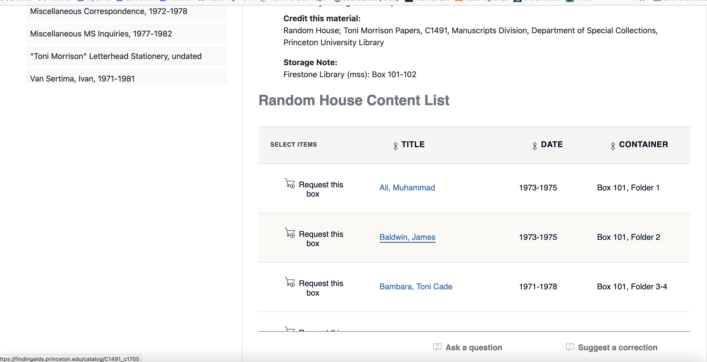

# Research Exercise # 7: Archives and Collections

For this short research exercise, you're going to identify **1-2 items** that you'd like to look at in our visit to Firestone Libraries Special Collections on Wednesday.

+  Part 1:  Using one of the three methods below, find 1-2 items that you would like to consult in our visit and submit them via email by **Tuesday morning.**
+ Part 2: In preparation for our visit, take some notes on how you plan to document the object, what kinds of questions you plant to ask (This longer writeup can be submit this on Wednesday)

### How to Read a Finding Aid

What is a finding aid? A finding aid is a a document crated by an archivist (or archivists) to describe a collection. They offer an inventory or an index to the contents of a collection held in an institutional archive and help a researcher or user navigate the contents to find relevant material. Unlike offers in a library catalog

What's in a finding aid? Finding aids contain **collections**, which are organized into **series**, which contain "**items**" (often stored in boxes or folders) that can be request for review in a reading room. Take a few minutes to read this short [2018 infographic  "What is A Finding Aid?,"](https://www.bates.edu/archives/files/2018/05/What-is-a-finding-aid_.pdf), created by archivists at Bates College for their Archives and Special Collections Library.

Finding aids will be vary in terms of their level of detail––there may be items in a collection not covered in a finding aid! This is because archival science balances different impulses: giving detailed enough information about the contents of a particular collection and making as many collections as possible available for researchers. Typically, a given collection may contain subsidies (like "Correspondence" or "Writings", along with brief descriptions of groupings of contents).

Here's an example finding aid for the "Princeton University Library Collection of Children's Publishers' and Retailers' Catalogs, 1913-2015" :

In the finding aids Collection description, you'll find:

+  "**Collection Creator**" - who assembled the materials together
+  "**Dates**" - the dates of material held in the collection
+  "**Extent**" - this is the size or scope of the collection
+  "**Languages**" - languages in the holdings
+  "**Description**" - a short description of the contents
+  " **Access Restrictions**" - a description of any restrictions to access
+  "**Credit this material**" - this is the citation format for the collection
+  A "**Content List**" - this lists the boxes where particular materials are to be found.

Examples of finding aids and collection overviews:

+ The Sylvia Beach Papers
	+ ["The Sylvia Beach Papers, 1872-1999"](https://findingaids.princeton.edu/catalog/C0108) [finding aid] 
	+ See how the Beach papers are [used as sources in the Shakespeare and Company Project](https://shakespeareandco.princeton.edu/sources/)
+ The Morrish Parrish collection.
	+ [Overview of M. L. Parrish Collection of Victorian Novelists](https://library.princeton.edu/special-collections/collections/m-l-parrish-collection-victorian-novelists)
	+ The Morrish Parrish collection holds 27 individual author collections for Parrish's collection of novelists. Catalog entries by author (in PDF file format) are available here:[ http://libweb2.princeton.edu/rbsc2/parrish/](http://libweb2.princeton.edu/rbsc2/parrish/) 
	+ ["M. L. Parrish Collection of Victorian Novelists, 1806-1958 (mostly 1830-1939)"](https://findingaids.princeton.edu/catalog/C0171) [finding aid]
		+ Note that the finding aid focuses on the *manuscript* and non-book portion of the collection
+ The Latin American Ephemera Collection
	+ Collection overview and library guide to the Latin American Ephemera Collection: [https://libguides.princeton.edu/laec]
	+   [Search within the finding aids in the Latin American Ephemera Collection](https://findingaids.princeton.edu/?f%5Brepository_sim%5D%5B%5D=Latin+American+Ephemera+Collections&group=true&q=&search_field=all_fields)

## 1. Finding items in the main library catalog

1. Go to the main library catalog (catalog.princeton.edu). 
2. In the left hand menu, under the "Library" facet, [select "Special Collections"](https://catalog.princeton.edu/?f%5Blocation%5D%5B%5D=Special+Collections)
3.  Now you can enter your keyword search
4.  Items in the catalog will be labeled as "Special collections," like so: 

5.  Within a catalog entry, you'll also get information about the item:

## 2. Finding items in the finding aid and manuscripts catalog

In addition to the main library catalog, Princeton also has an option to search just the contents (and metadata) of the finding aids.

1. Go to the Princeton University Library Finding Aids catalog: https://findingaids.princeton.edu/
2. In the lefthand menu, under the "Repository" facet, select––depending your interests–– one of the divisions in Firestone Special Collections :
	+ ["Manuscripts Division"](https://findingaids.princeton.edu/?f%5Brepository_sim%5D%5B%5D=Manuscripts+Division&group=true&q=&search_field=all_fields) 
	+ or ["Rare Book Division"](https://findingaids.princeton.edu/?f%5Brepository_sim%5D%5B%5D=Rare+Book+Division&group=true&q=&search_field=all_fields) 
	+ or ["Latin American Ephemera Collections"](https://findingaids.princeton.edu/?f%5Brepository_sim%5D%5B%5D=Latin+American+Ephemera+Collections&group=true&q=&search_field=all_fields)
	+ or ["Cotsen Children's Library"](https://findingaids.princeton.edu/?f%5Brepository_sim%5D%5B%5D=Cotsen+Children%27s+Library&group=true&q=&search_field=all_fields)
3. Once you've navigated to the correct division, you can keyword search the finding aids:

Here is the overview pages of Princeton resources (which includes links to non-Princeton archives as well): https://library.princeton.edu/databases/subject/archives-manuscripts

## 3. Finding items within a finding aid

Once you've found a finding aid relevant to your interests, you'll want to 

1. Using the Contents and Arrangement or Collection overivew, click through to find your Item

2. Once you've located the box or folders you would like to examine, click "request box"

3. On rare occasions, the finding aid will also link to any digitized content. 
	+  In Princetons finding aids, these are marked with a green indicator:
		+  Ex: All of the lending library cards for the Shakespeare & Company records in the Sylvia Beach Papers contain links to the digital facsimiles (scans of the cards)

